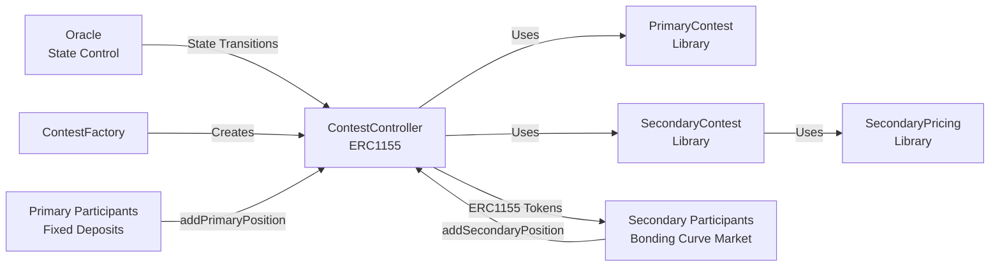

# Contest Catalyst

Combined competition format:

- **Tournament Contest:** a traditional competition format with established profitability
- **Prediction Market:** a betting mechanism layered on top of the tournament outcomes, also with proven profitability

Why? Balancing & pooling incentives to become more than the sum of its parts:

- **Dynamic Incentives:** fluid movement of value between layers changes incentives in real-time, sparking interest and driving activity
- **Recursive Positive Feedback**: both markets become more compelling as prize pools grow, which recursively attracts more participants and amplifies engagement

## Purpose and Functionality

Contest Catalyst enables competitions where participants compete in a primary layer while spectators can predict outcomes in a secondary layer.

**Primary Layer**: Fixed deposit competitions where participants enter with a set deposit amount. The oracle distributes prizes based on real-world results, and winners claim their payouts.

**Secondary Layer**: Prediction market on primary outcomes using polynomial bonding curve pricing. Secondary participants buy ERC1155 tokens representing positions on primary entries. Key features:

- Winner-take-all redemption based on primary results
- Position bonuses: portion of secondary deposits go to primary entry owners
- Dynamic cross-subsidy: balances prize pools between primary and secondary sides
- Withdrawals allowed during OPEN phase only (full refund)

## Architecture Overview

The system uses a two-layer architecture with the oracle as an external mediator:



### Contract Structure

- **[ContestFactory](src/ContestFactory.sol)**: Factory for creating new contest instances
- **[ContestController](src/ContestController.sol)**: Main orchestrator contract managing both layers
  - Inherits ERC1155 for secondary position tokens
  - Manages prize pools and cross-subsidies
  - Handles state transitions (oracle-controlled)
- **[PrimaryContest](src/PrimaryContest.sol)**: Library for primary mechanics (add/remove positions, claims)
- **[SecondaryContest](src/SecondaryContest.sol)**: Library for secondary mechanics (position management, ERC1155 operations)
- **[SecondaryPricing](src/SecondaryPricing.sol)**: Polynomial bonding curve pricing (`price = BASE_PRICE + COEFFICIENT * shares²`)

### State Machine

```
OPEN → ACTIVE → LOCKED → SETTLED
  ↓              ↓
CANCELLED      CLOSED
```

- **OPEN**: Primary participants join, secondary participants add positions, withdrawals allowed
- **ACTIVE**: Primary positions locked, secondary still open, no withdrawals
- **LOCKED**: Secondary positions closed
- **SETTLED**: Results in, users claim payouts
- **CANCELLED**: Contest cancelled, refunds available
- **CLOSED**: Force distributed

## Quick Usage Guide

### Primary Participants

```solidity
// Add a position (must deposit exact primaryDepositAmount)
contest.addPrimaryPosition(entryId, merkleProof);

// Remove position during OPEN phase (full refund)
contest.removePrimaryPosition(entryId);

// Claim payout after settlement
contest.claimPrimaryPayout(entryId);
```

### Secondary Participants

```solidity
// Add position on an entry (variable amount, gets ERC1155 tokens)
contest.addSecondaryPosition(entryId, amount, merkleProof);

// Remove position during OPEN phase only (full refund)
contest.removeSecondaryPosition(entryId, tokenAmount);

// Claim payout after settlement (winner-take-all)
contest.claimSecondaryPayout(entryId);
```

### Oracle Functions

```solidity
// State transitions
contest.activateContest();        // OPEN → ACTIVE
contest.lockContest();            // ACTIVE → LOCKED
contest.settleContest(winningEntries, payoutBps);  // LOCKED → SETTLED

// Optional: Push payouts for efficiency
contest.pushPrimaryPayouts(entryIds);
contest.pushSecondaryPayouts(participantAddresses, entryId);

// Other oracle functions
contest.setPrimaryMerkleRoot(root);
contest.setSecondaryMerkleRoot(root);
contest.cancelContest();
contest.closeContest();
contest.claimOracleFee();
```

### View Functions

```solidity
// Pricing
uint256 price = contest.calculateSecondaryPrice(entryId);

// Balances
uint256 primaryBalance = contest.getPrimarySideBalance();
uint256 secondaryBalance = contest.getSecondarySideBalance();
uint256 shareBps = contest.getPrimarySideShareBps();  // Primary share as basis points

// Entry enumeration
uint256 count = contest.getEntriesCount();
uint256 entryId = contest.getEntryAtIndex(index);
```

## Deployment Guide

### 1. Deploy Factory

Deploy `ContestFactory` first:

```bash
forge script script/DeployFactory.s.sol:DeployFactoryScript \
  --rpc-url <your_rpc_url> \
  --private-key <your_private_key> \
  --broadcast
```

### 2. Create Contest

Use the factory to create a new contest:

```solidity
address contest = factory.createContest(
    paymentToken,           // ERC20 token address (e.g., CUT)
    oracle,                 // Oracle address (controls state)
    contestantDepositAmount, // Fixed deposit for primary participants
    oracleFee,              // Oracle fee in basis points (max 1000 = 10%)
    expiry,                 // Expiration timestamp
    positionBonusShareBps,  // Portion of subsidy to position bonuses (e.g., 5000 = 50%)
    targetPrimaryShareBps,  // Target primary share for cross-subsidy balancing
    maxCrossSubsidyBps      // Max cross-subsidy per deposit
);
```

### Example Parameters

- `paymentToken`: Address of ERC20 token (typically platform token)
- `oracleFee`: 100 = 1% fee
- `positionBonusShareBps`: 5000 = 50% of accumulated subsidy to bonuses
- `targetPrimaryShareBps`: 5000 = target 50/50 split between pools
- `maxCrossSubsidyBps`: 1000 = max 10% of deposit redirected

## Testing Guide

### Run All Tests

```bash
forge test
```

### Run Specific Test File

```bash
# Main integration tests
forge test --match-path test/ContestController.t.sol

# Pricing tests
forge test --match-path test/SecondaryPricing.t.sol

# Primary layer tests
forge test --match-path test/PrimaryContest.t.sol

# Secondary layer tests
forge test --match-path test/SecondaryContest.t.sol
```

### Test Coverage

```bash
forge coverage
```

### Gas Snapshots

```bash
forge snapshot
```

### Key Test Files

- **[ContestController.t.sol](test/ContestController.t.sol)**: Main integration tests covering both layers
- **[SecondaryPricing.t.sol](test/SecondaryPricing.t.sol)**: Bonding curve pricing tests
- **[PrimaryContest.t.sol](test/PrimaryContest.t.sol)**: Primary mechanics tests
- **[SecondaryContest.t.sol](test/SecondaryContest.t.sol)**: Secondary mechanics tests

## Development

### Build

```bash
forge build
```

### Format

```bash
forge fmt
```

### Local Node

```bash
anvil
```
