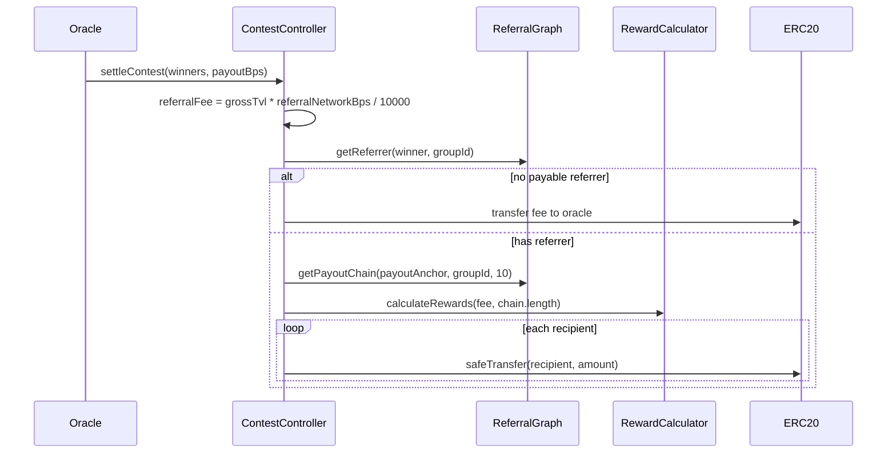

# Referral Network Integration

Replace claim-time oracle fees with settlement-time referral network fees (`referralNetworkBps`), integrated with [referralTree](https://github.com/MagRelo/referralTree)'s `ReferralGraph` + `RewardCalculator`. At settlement, the fee is deducted from distributable TVL and atomically pushed up the **winning entry owner's referrer chain** — the winner is the lookup key only and is **not** a referral-fee recipient.

**Implemented:** [`ContestController.sol`](src/ContestController.sol) uses `referralNetworkBps` (5% standard), deducts the fee once at settlement from total distributable TVL, and pays the geometric split from contest balance when the winner has a real referrer; otherwise sends the fee to `oracle`. Claims/pushes pay **full net amounts** with no further fee deduction. Per-contest `referralGraph`, `rewardCalculator`, and `referralGroupId` are set on `createContest`.

## Flow

## Config

| Field | Notes |
| --- | --- |
| `ContestController.referralGraph` | Per-contest immutable |
| `ContestController.rewardCalculator` | Per-contest immutable |
| `ContestController.referralGroupId` | Per-contest immutable |
| `ContestController.referralNetworkBps` | Max 1000 (10%) |

Rationale: referralTree is shared attribution + split math. The contest owns custody and pays recipients directly during `settleContest` (already `onlyOracle`), so no signed `ChainRewardData` or escrow middleman is required.

## Settlement behavior

1. Compute `referralFee` from gross primary + secondary TVL.
2. Shrink primary/secondary pools by `netBps = 10000 - referralNetworkBps`.
3. If `referralFee > 0`, `distributeReferralFee` runs via a self-call try/catch:
   - On any failure (reverting graph/calculator, reward length mismatch, rewards summing above fee, or transfer revert), the full fee is sent to `oracle` and settlement continues.
   - Success path: `payoutAnchor = getReferrer(winner)`; empty/`REFERRAL_ROOT` → fee to oracle; else `getPayoutChain` + `calculateRewards` + transfers.

**Important:** Chain seed is the winner’s **immediate referrer**, not the winner. The winner already receives primary/secondary winnings and must not double-dip on the referral fee.

## Trust assumptions

- Contest operators must trust `ReferralGraph.owner` and the group’s authorized oracles. An authorized oracle can register an unregistered winner under an attacker-controlled referrer before settlement redirects up to `referralNetworkBps` of TVL. Participants should register referrers before settle, and operators should use a trustworthy graph/oracle set. Live `getReferrer` at settle (no lock-time snapshot) is intentional.
- Prefer a multisig for contest `oracle`. `paymentToken` must be a standard ERC20 (no fee-on-transfer / rebasing).

## Tests

[`ReferralTestHarness.sol`](test/helpers/ReferralTestHarness.sol) deploys real `ReferralGraph` + `RewardCalculator` and simplifies `_settleContest` to `settleContest(winners, payouts)`.

Key cases in [`ContestController.t.sol`](test/ContestController.t.sol):

- `test_settleContest_ReferralFeeDistributed` — referrer receives geometric amount; winner balance unchanged by fee
- `test_settleContest_ReferralFeeZeroSkipsDistribution` — `referralNetworkBps = 0`
- `test_settleContest_UnregisteredWinner_FeeToOracle` — full fee to oracle

## Indexing

- Payable chain: `ReferralNetworkFeeDistributed` on the contest (includes recipients + amounts)
- No chain: `ReferralNetworkFeeToOracle` on the contest
